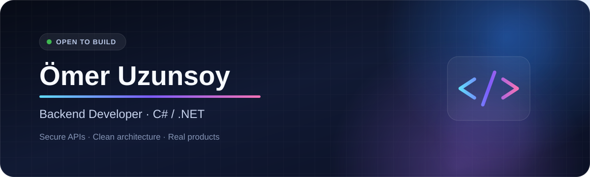

<div align="center">



<br />

<a href="https://omeruzunsoy.github.io/"></a>
<a href="https://www.linkedin.com/in/%C3%B6mer-uzunsoy/"></a>
<a href="mailto:uzunsoyomer@gmail.com"></a>
<a href="https://github.com/OmerUzunsoy?tab=repositories"></a>

</div>

## Hello, I'm Ömer

I'm a Computer Programming student in Istanbul, building backend systems with **C# and .NET**. I care about the parts that turn a demo into a real product: clear architecture, secure authentication, reliable data flows, validation, testing, logging, and useful documentation.

```csharp
var currentFocus = new[]
{
    "Production-minded ASP.NET Core APIs",
    "Authentication, authorization and caching",
    "Clean architecture and maintainable code"
};
```

## Selected Work

<table>
<tr>
<td width="50%" valign="top">

### [E-Commerce Backend API](https://github.com/OmerUzunsoy/E-Commerce-Backend-API)

A production-style .NET 9 API with layered architecture, JWT + refresh tokens, role-based access, Redis caching, validation, logging, tests, and Docker.

**Built with**  
`ASP.NET Core` `EF Core` `SQL Server` `Redis` `Docker`

[Explore repository →](https://github.com/OmerUzunsoy/E-Commerce-Backend-API)

</td>
<td width="50%" valign="top">

### [Job Application Tracker](https://github.com/OmerUzunsoy/Job-Application-Tracker-API)

An authenticated backend for managing applications, interviews, notes, and hiring stages with search, filtering, sorting, and dashboard insights.

**Built with**  
`ASP.NET Core` `EF Core` `SQL Server` `JWT`

[Explore repository →](https://github.com/OmerUzunsoy/Job-Application-Tracker-API)

</td>
</tr>
<tr>
<td width="50%" valign="top">

### [UzunsIPTV](https://github.com/OmerUzunsoy/UzunsIPTV)

An Android TV and mobile IPTV player supporting Xtream Codes, M3U playlists, live TV, VOD, series, favorites, and watch progress.

**Built with**  
`Kotlin` `ExoPlayer` `Retrofit` `Room` `MVVM`

[Explore repository →](https://github.com/OmerUzunsoy/UzunsIPTV)

</td>
<td width="50%" valign="top">

### [Library Automation](https://github.com/OmerUzunsoy/Kutuphane_Otomasyonu)

A role-based desktop system for members, staff, inventory, loans, returns, penalties, announcements, and daily library workflows.

**Built with**  
`C#` `.NET Framework` `WinForms` `SQL Server` `ADO.NET`

[Explore repository →](https://github.com/OmerUzunsoy/Kutuphane_Otomasyonu)

</td>
</tr>
</table>

## Toolbox

<table>
<tr>
<td><strong>Core</strong></td>
<td>C# · .NET · ASP.NET Core · REST APIs</td>
</tr>
<tr>
<td><strong>Data</strong></td>
<td>Entity Framework Core · SQL Server · PostgreSQL · SQLite · Redis</td>
</tr>
<tr>
<td><strong>Quality</strong></td>
<td>xUnit · FluentValidation · Swagger / OpenAPI · Serilog</td>
</tr>
<tr>
<td><strong>Delivery</strong></td>
<td>Git · GitHub · Docker · Postman · Linux</td>
</tr>
<tr>
<td><strong>Also building with</strong></td>
<td>Python · Kotlin · Android · Windows Forms</td>
</tr>
</table>

## How I Work

- I start with the problem and model the data before writing endpoints.
- I keep controllers thin and separate business logic from infrastructure.
- I treat authentication, validation, errors, and logs as product features.
- I document projects so another developer can run and understand them.

---

<div align="center">

### Let's build something useful.

[Portfolio](https://omeruzunsoy.github.io/) · [LinkedIn](https://www.linkedin.com/in/%C3%B6mer-uzunsoy/) · [Email](mailto:uzunsoyomer@gmail.com)

<sub>Based in Istanbul, Türkiye · Learning in public, improving with every project.</sub>

</div>
